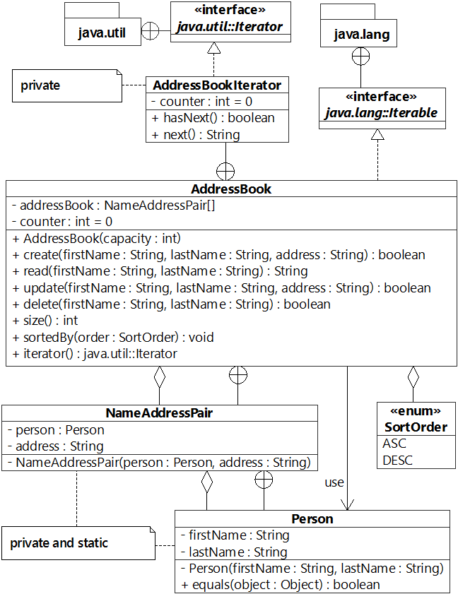

# -Inner-outer-class.-Enum-
Practice tasks.

############ Task 1 ############
 
<pre>
Suppose we have the next class:
 
<code>
public class Pizza{
    
    private String cheese;
    private String meat;
    private String seafood;
    private String vegetable;
    private String mushroom;
    
    public Pizza(){
        
    }
    public static PizzaBuilder  base(){
        
        return new PizzaBuilder();
        
    }
    
}

</code>
</pre>

Create public static inner class named PizzaBuilder inside Pizza class that correspond the next class diagram:

<pre>
                PizzaBuilder
- pizza: Pizza
- PizzaBuilder()
+ addCheese(cheese:String): PizzaBuilder
+ addMeat(meat:String): PizzaBuilder
+ addSeafood(seafood:String): PizzaBuilder
+ addVegetablee(vegetable:String): PizzaBuilder
+ addMushroom(mushroom:String): PizzaBuilder
+ build():Pizza

</pre>
############ Task 2 ############

<pre>
Suppose we have the next class:

<code>
class NameList{
    
    private String[] names = {"Mike","Emily","Nick","Patric","Sara"};
    
    public Iterator getIterator(){
        return new Iterator();
    }
}
</code>
Create public inner class named Iterator inside NameList class that correspond the next class diagram:

<code>
                  Iterator
- counter: int = 0
- Iterator()
+ hasNext():boolean //returns true if the next element exist in the list,otherwise returns false
+ next(): String //return current element and add 1 to counter
</code>
</pre>
############ Task 3 ############

<pre>
<code>
Suppose we have execute method with next signature:

public static double execute(int a, int b, Strategy strategy){

    double result = strategy.doOperation(a,b);
    
    System.out.println(result);
    
    return result;
}
where the Stategy is the next interface:

interface Strategy{

    double doOperation(int a,int b);
    
}
</code>
Using anonymous classes concept, call the execute method 4 times with different strategy (override method doOperation from Strategy interface):

Add a to b   \\   (a + b)
Subtract b from a   \\   (a - b)
Multiply a by b   \\   (a * b)
Divide a by b   \\   (a / b)
</pre>
############ Task 4 ############

Create a LineType enum that contains different kind of lines as constants SOLID, DOTTED, DASHED and DOUBLE.

Write a method that takes the constant of LineType type as input, and returns the message “The line is <LineType> type”.

Where <LineType>  is name of type wrote in lower case.

For example: The line is dotted type.
############ Task 5 ############
 
 
Create ClientType enum that contains NEW, SILVER, GOLD and PLATINUM constants that represent client status.

For storing count of months for each client create private "months" field of type int and initialize it using constructor with int parameter.

Set for each item of enum a value according to next table:
<pre>
Client status                                                   Count of months

    NEW                                                              1

    SILVER                                                          12

    GOLD                                                            30

    PLATINUM                                                        60
    

Create public method named “discount()” that return discount value as coefficient from 1.0 to 0.0 according to client status.

By default discount() method should return value 1.0 of double type.

Override discount() method for each constant and return discount value that calculated by next formula:

       Client status                                Formula

            NEW                                   Default value
           SILVER                                (100 - <count of months> * 0,25) / 100
           GOLD                                  (100 - <count of months> * 0,3) / 100
          PLATINUM                               (100 - <count of months> * 0,35) / 100

</pre>
############ Task 6 ############

Create class hierarchy that represent Address Book, where can be save records in format: "(first name, last name) => address":

Records in the Addres Book should be represented as objects of the NameAddressPair type.
The pair "(first name, last name)" is key for access to "address" in the Address Book.
The key "(first name, last name)" should be immuteble and in Address Book cannot be two records with same key.
The capacity of Address Book must grow twice when has no place for save the next record.
The sortedBy(...) method should sorted records by ascending or descending using for this Arrays.sort(...) method.
The Comparator should be implemented as an anonymous class.
Sorting at first be by firstName field, and if the names match then by lastName field.
The next() method from AddressBookIterator class should return record as String in next format: "First name: <first name>, Last name: <last name>, Address: <address>".
Records in the Address Book must be ordered according to date of creation.
A class hierarchy should be correspond the next class diagram:

